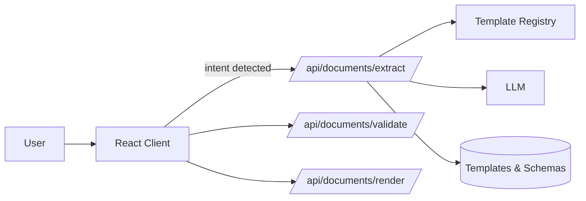

# Architecture

## System Context
The assistant is composed of a Vite-powered React client, serverless API routes, and a document router that orchestrates extraction, validation, and rendering. Templates and schemas live in a registry that the router uses to resolve charter, DDP, and future document types on demand.

- **React Client (`src/`)** – Captures chat messages, attachments, and voice input while detecting intent locally.
- **Serverless API (`api/`)** – Provides chat, transcription, and `/api/documents/*` handlers deployed to a serverless runtime.
- **Document Router (`lib/doc/`)** – Normalizes requests, loads manifest metadata from [`templates/registry.js`](../templates/registry.js), and orchestrates extraction pipelines.
- **Template Registry (`templates/`)** – Encapsulates prompts, schemas, and encoded templates for each doc type.

## Core Components
- **Intent Detection (`src/utils/detectCharterIntent.js`)** – Returns `{ docType, action, intentText }` when user input clearly requests a document.
- **Extraction Handler (`api/documents/extract.js`)** – Validates intent + context, loads doc-type manifests, and calls OpenAI with structured prompts.
- **Validation Handler (`api/documents/validate.js`)** – Compiles Ajv validators using `schema.json` and `field_rules.json` assets for the selected doc type.
- **Rendering Handler (`api/documents/render.js`)** – Streams DOCX/PDF responses using encoded templates.
- **Chat Interfaces (`api/chat.js`, `api/chat/stream.js`)** – Provide conversational assistance with optional streaming for long-running responses.

## Data Flow

## Dependencies
- **Node.js + Vite** – Development server and build tooling.
- **OpenAI SDK** – LLM interactions for extraction and chat.
- **Ajv** – JSON Schema validation in the `/api/documents/validate` handler.
- **Docxtemplater/pdfmake utilities** – Template rendering for charter and future doc types.

## Observability & Failure Modes
- **Intent guardrails** – `/api/documents/extract` returns HTTP 400 when intent is missing and 422 when context is absent. These responses surface in the client UI for rapid diagnosis.
- **Router logging** – Serverless handlers log doc type, manifest version, and validation status to aid troubleshooting.
- **LLM fallbacks** – Prompts return `{ "result": "no_op" }` when intent metadata is absent, preventing accidental downstream automations.
- **Deployment checks** – CI enforces linting, tests, and docs link validation. Review [`docs/OPERATIONS.md`](./OPERATIONS.md) for rollout guidance and [`docs/SECURITY.md`](./SECURITY.md) for runtime hardening expectations.
