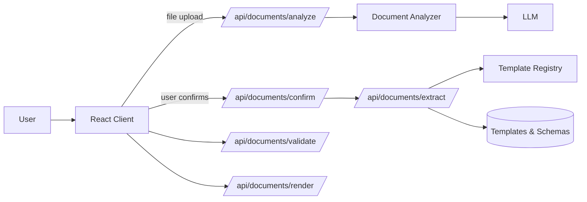
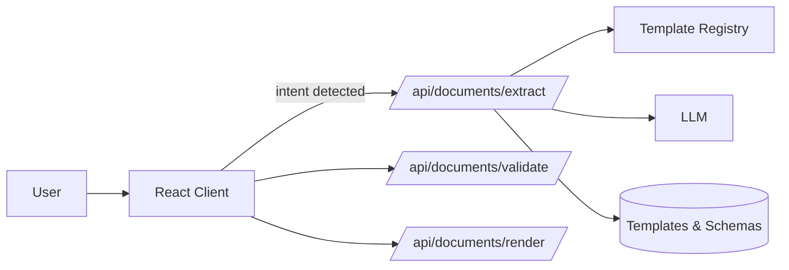

# Architecture

## System Context
The assistant is composed of a Vite-powered React client, serverless API routes, and a document router that orchestrates analysis, extraction, validation, and rendering. Templates and schemas live in a registry that the router uses to resolve charter, DDP, and future document types on demand.

- **React Client (`src/`)** – Captures chat messages, attachments, and voice input; triggers document analysis on file upload.
- **Serverless API (`api/`)** – Provides chat, transcription, document analysis, and `/api/documents/*` handlers deployed to a serverless runtime.
- **Document Router (`lib/doc/`)** – Normalizes requests, loads manifest metadata from [`templates/registry.js`](../templates/registry.js), and orchestrates analysis and extraction pipelines.
- **Template Registry (`templates/`)** – Encapsulates prompts, schemas, and encoded templates for each doc type.
- **Document Analysis Service (`server/documents/analysis/`)** – LLM-powered document classification, intent inference, and field preview generation.

## Core Components
- **Document Analyzer (`server/documents/analysis/DocumentAnalyzer.js`)** – Orchestrates LLM-based document analysis, classifies document types, and generates extraction previews.
- **Analysis Handler (`api/documents/analyze.js`)** – Analyzes uploaded documents, returns classification with confidence scores and suggested targets.
- **Confirmation Handler (`api/documents/confirm.js`)** – Processes user confirmation and triggers the extraction pipeline.
- **Intent Detection (`src/utils/detectCharterIntent.js`)** – **Fallback mode:** Returns `{ docType, action, intentText }` when user input clearly requests a document. Used when `DOCUMENT_ANALYSIS_ENABLED=false`.
- **Extraction Handler (`api/documents/extract.js`)** – Validates intent + context (or accepts `analysisId`), loads doc-type manifests, and calls OpenAI with structured prompts.
- **Validation Handler (`api/documents/validate.js`)** – Compiles Ajv validators using `schema.json` and `field_rules.json` assets for the selected doc type.
- **Rendering Handler (`api/documents/render.js`)** – Streams DOCX/PDF responses using encoded templates.
- **Chat Interfaces (`api/chat.js`, `api/chat/stream.js`)** – Provide conversational assistance with optional streaming for long-running responses.

## Document Analysis Pipeline

When `DOCUMENT_ANALYSIS_ENABLED=true` (default), the system uses an LLM-analysis-driven flow instead of regex-based intent detection:

### Analysis Flow
```
User uploads document
       ↓
┌──────────────────────────────────────┐
│   LLM Document Analysis Pipeline     │
│   ─────────────────────────────────  │
│   1. Content extraction (text/tables)│
│   2. Document type classification    │
│   3. Intent/purpose inference        │
│   4. Field mapping preview           │
│   5. Confidence scoring              │
└──────────────────────────────────────┘
       ↓
System presents analysis to user:
"This appears to be a project scope document.
 I can use it to create a Project Charter.
 Confidence: 87%"
       ↓
User confirms or selects alternative
       ↓
LLM performs full extraction → Fields populated
```

### Document Classification Categories

| Source Type | Primary Target | Secondary Targets |
|-------------|---------------|-------------------|
| Project Scope | Charter | DDP, SOW |
| Meeting Notes | Charter (updates) | DDP |
| Requirements | DDP | Charter |
| Proposals | Charter | SOW |
| Contracts | SOW | Charter |

### Confidence-Based UX

The system adjusts its UI response based on classification confidence:

- **High (>80%)**: Direct suggestion with quick confirm button
- **Medium (50-80%)**: Multiple options presented for user selection
- **Low (<50%)**: Clarifying questions asked before proceeding

### Two-Phase Extraction

1. **Preview Extraction (Lightweight)** – Run during analysis to show key fields; fast response (<2 seconds)
2. **Full Extraction (Comprehensive)** – Run after user confirmation; extracts all fields with validation

### Analysis State Machine
```
                    ┌─────────────┐
                    │   IDLE      │
                    └──────┬──────┘
                           │ upload
                           ▼
                    ┌─────────────┐
                    │  ANALYZING  │
                    └──────┬──────┘
                           │ analysis complete
                           ▼
              ┌────────────┴────────────┐
              │                         │
              ▼                         ▼
     ┌────────────────┐       ┌────────────────┐
     │ AWAITING_      │       │ NEEDS_         │
     │ CONFIRMATION   │       │ CLARIFICATION  │
     └───────┬────────┘       └───────┬────────┘
             │                        │
             │ confirm                │ user response
             │                        │
             ▼                        │
     ┌────────────────┐               │
     │  EXTRACTING    │◄──────────────┘
     └───────┬────────┘
             │ extraction complete
             ▼
     ┌────────────────┐
     │  COMPLETE      │
     └────────────────┘
```

### Analysis Caching

Analysis results are cached to support the confirmation flow:
- **TTL**: 15 minutes (configurable via `ANALYSIS_CACHE_TTL_SECONDS`)
- **Storage**: In-memory for serverless, Redis/Upstash for production scale
- **Keys**: Session-keyed with automatic TTL cleanup

## Legacy Intent-Driven Mode (Fallback)

When `DOCUMENT_ANALYSIS_ENABLED=false`, the system reverts to the original intent-driven flow:

1. User uploads file + sends explicit intent message
2. `detectCharterIntent()` validates intent via regex patterns
3. `POST /api/documents/extract` with intent + context
4. Extraction proceeds only if intent is detected

This fallback mode preserves backward compatibility and can be used when LLM analysis is not desired.

## Data Flow

### Primary Flow (Analysis-Driven)


### Fallback Flow (Intent-Driven)


## Dependencies
- **Node.js + Vite** – Development server and build tooling.
- **OpenAI SDK** – LLM interactions for analysis, extraction, and chat.
- **Ajv** – JSON Schema validation in the `/api/documents/validate` handler.
- **Docxtemplater/pdfmake utilities** – Template rendering for charter and future doc types.
- **@modelcontextprotocol/sdk** – MCP client/server implementation for AI tool orchestration.
- **@azure/msal-node** – Microsoft authentication for Office 365 integration.

## MCP Integration

Model Context Protocol (MCP) enables AI-orchestrated workflows where the AI can autonomously call tools to complete complex tasks.

### Architecture

```
┌─────────────────────────────────────────────────────────────────┐
│                    Exact Virtual Assistant                       │
│  ┌──────────────────────────────────────────────────────────┐   │
│  │                    MCP Client Layer                       │   │
│  │   (server/mcp/MCPClientManager.ts)                        │   │
│  └────────────────────────┬─────────────────────────────────┘   │
│                           │                                      │
│  ┌────────────────────────┴─────────────────────────────────┐   │
│  │              OpenAI Tool Bridge                           │   │
│  │   (server/mcp/openaiToolBridge.ts)                        │   │
│  │   Converts MCP tools to OpenAI function calling format    │   │
│  └──────────────────────────────────────────────────────────┘   │
└─────────────────────────────────────────────────────────────────┘
              │                    │                    │
              ▼                    ▼                    ▼
    ┌─────────────────┐  ┌─────────────────┐  ┌─────────────────┐
    │  exact-va       │  │  smartsheet     │  │  office365      │
    │  MCP Server     │  │  MCP Server     │  │  MCP Server     │
    │  (internal)     │  │  (external)     │  │  (external)     │
    └────────┬────────┘  └────────┬────────┘  └────────┬────────┘
             │                    │                    │
             ▼                    ▼                    ▼
    ┌─────────────────┐  ┌─────────────────┐  ┌─────────────────┐
    │  Existing APIs  │  │  Smartsheet     │  │  Microsoft      │
    │  extract/       │  │  REST API       │  │  Graph API      │
    │  validate/      │  │                 │  │  SharePoint/    │
    │  review/render  │  │                 │  │  Teams/Outlook  │
    └─────────────────┘  └─────────────────┘  └─────────────────┘
```

### MCP Servers

| Server | Location | Purpose |
|--------|----------|---------|
| exact-va | `mcp-servers/exact-va/` | Wraps internal document capabilities as tools |
| smartsheet | `mcp-servers/smartsheet/` | Smartsheet sheet and row operations |
| office365 | `mcp-servers/office365/` | SharePoint, Teams, Outlook, Excel via Graph API |

### Internal Tools (exact-va)

| Tool | Wraps |
|------|-------|
| `document_extract` | `extractFieldsFromUtterance()` |
| `document_validate` | `/api/documents/validate` |
| `document_review` | `/api/documents/review` |
| `document_render` | `/api/documents/render` |
| `document_analyze` | `/api/documents/analyze` |
| `field_feedback` | Field validation + schema hints |
| `draft_update` | Draft store updates |
| `guided_navigate` | Guided session navigation |

### Configuration

MCP servers are configured in `config/mcp-servers.json`:

```json
{
  "servers": {
    "exact-va": { "enabled": true },
    "smartsheet": { "enabled": false, "requiredEnv": ["SMARTSHEET_API_KEY"] },
    "office365": { "enabled": false, "requiredEnv": ["AZURE_CLIENT_ID", "..."] }
  }
}
```

Environment variables control which servers are active:
- `MCP_ENABLED` – Master switch for MCP integration
- `SMARTSHEET_API_KEY` – Enables Smartsheet server
- `AZURE_CLIENT_ID`, `AZURE_CLIENT_SECRET`, `AZURE_TENANT_ID` – Enables Office 365 server

## Observability & Failure Modes
- **Analysis guardrails** – `/api/documents/analyze` returns classification with confidence scores; low-confidence results trigger clarification flows.
- **Intent guardrails (fallback)** – `/api/documents/extract` returns HTTP 400 when intent is missing and 422 when context is absent. These responses surface in the client UI for rapid diagnosis.
- **Router logging** – Serverless handlers log doc type, manifest version, analysis confidence, and validation status to aid troubleshooting.
- **LLM fallbacks** – Prompts return `{ "result": "no_op" }` when intent metadata is absent, preventing accidental downstream automations.
- **Analysis caching** – Cached analysis results enable efficient confirmation flows and reduce redundant LLM calls.
- **Deployment checks** – CI enforces linting, tests, and docs link validation. Review [`docs/OPERATIONS.md`](./OPERATIONS.md) for rollout guidance and [`docs/SECURITY.md`](./SECURITY.md) for runtime hardening expectations.

## Related Documentation
- [`docs/LLM-DOCUMENT-EXTRACTION-STRATEGY.md`](./LLM-DOCUMENT-EXTRACTION-STRATEGY.md) – Full strategy document for the analysis-driven extraction system
- [`docs/MCP-INTEGRATION-STRATEGY.md`](./MCP-INTEGRATION-STRATEGY.md) – MCP integration for AI orchestration and external services
- [`docs/document-workflow.md`](./document-workflow.md) – Detailed workflow documentation
- [`docs/API.md`](./API.md) – API endpoint reference
