# Test Scenario Catalog

_Last updated: 2025-11-07T04:30:24.474Z_

## Overview

- Total scenarios: 41
- Unique features: 5
- Unique CI suites: 3

### Scenarios by CI suite

| Suite | Count |
| --- | --- |
| e2e-guided | 4 |
| e2e-wizard | 3 |
| unmapped | 37 |

### Scenarios by feature

| Feature | Count |
| --- | --- |
| charter | 1 |
| chat | 1 |
| platform | 1 |
| unknown | 37 |
| voice | 1 |

### Scenarios by environment

| Environment | Count |
| --- | --- |
| guided | 4 |
| unspecified | 37 |
| wizard | 3 |

## Feature × Environment × Suite matrix

```mermaid
graph TD
  feature_unknown["Feature: unknown"]
  scenario_api_chat_test["Scenario: Api Chat Test"]
  env_unspecified["Env: unspecified"]
  suite_unmapped["Suite: unmapped"]
  scenario_api_doc_routes_test["Scenario: Api Doc Routes Test"]
  scenario_api_documents_extract_test["Scenario: Api Documents Extract Test"]
  scenario_api_export_pdf_test["Scenario: Api Export Pdf Test"]
  feature_platform["Feature: platform"]
  scenario_application_smoke_validation["Scenario: Application smoke validation"]
  env_guided["Env: guided"]
  suite_e2e_guided["Suite: e2e-guided"]
  suite_e2e_wizard["Suite: e2e-wizard"]
  env_wizard["Env: wizard"]
  scenario_assistantfeedbackrichtext_test["Scenario: AssistantFeedbackRichText Test"]
  scenario_audiomath_test["Scenario: AudioMath Test"]
  scenario_buildextractionpayload_test["Scenario: BuildExtractionPayload Test"]
  scenario_charter_download_api_spec["Scenario: Charter Download Api Spec"]
  scenario_charter_formschema_test["Scenario: Charter FormSchema Test"]
  scenario_charter_link_download_test["Scenario: Charter Link Download Test"]
  scenario_charter_normalize_test["Scenario: Charter Normalize Test"]
  scenario_charter_render_aliases_test["Scenario: Charter Render Aliases Test"]
  scenario_charter_render_handler_test["Scenario: Charter Render Handler Test"]
  scenario_charter_render_smoke_test["Scenario: Charter Render Smoke Test"]
  scenario_chat_no_placeholders_spec["Scenario: Chat No Placeholders Spec"]
  scenario_chatcharterwizard_integration_test["Scenario: ChatCharterWizard Integration Test"]
  scenario_chatcomposer_integration_test["Scenario: ChatComposer Integration Test"]
  scenario_chatdoctypecommands_test["Scenario: ChatDocTypeCommands Test"]
  scenario_composer_voice_status_test["Scenario: Composer Voice Status Test"]
  scenario_conversationmachine_test["Scenario: ConversationMachine Test"]
  scenario_conversationvalidation_test["Scenario: ConversationValidation Test"]
  scenario_doc_router_on_spec["Scenario: Doc Router On Spec"]
  scenario_doctemplatestore_test["Scenario: DocTemplateStore Test"]
  scenario_doctypecontext_test["Scenario: DocTypeContext Test"]
  scenario_doctyperouter_test["Scenario: DocTypeRouter Test"]
  scenario_doctypestate_test["Scenario: DocTypeState Test"]
  scenario_document_preview_sync_spec["Scenario: Document Preview Sync Spec"]
  scenario_export_pdf_test["Scenario: Export Pdf Test"]
  scenario_golden_conversations_test["Scenario: Golden Conversations Test"]
  feature_charter["Feature: charter"]
  scenario_guided_charter_chat_happy_path["Scenario: Guided charter chat happy path"]
  scenario_guidedstate_spec["Scenario: GuidedState Spec"]
  scenario_mergeintodraftwithlocks_test["Scenario: MergeIntoDraftWithLocks Test"]
  feature_chat["Feature: chat"]
  scenario_multimodal_assistant_chat_flows["Scenario: Multimodal assistant chat flows"]
  scenario_onfileattached_test["Scenario: OnFileAttached Test"]
  scenario_persist_spec["Scenario: Persist Spec"]
  scenario_preview_manifest_test["Scenario: Preview Manifest Test"]
  scenario_storage_safe_mode_test["Scenario: Storage Safe Mode Test"]
  scenario_syncstore_test["Scenario: SyncStore Test"]
  scenario_telemetry_fieldmetrics_test["Scenario: Telemetry FieldMetrics Test"]
  feature_voice["Feature: voice"]
  scenario_voice_microphone_level_indicator_renders_and_updates["Scenario: Voice microphone level indicator renders and updates"]
  feature_unknown --> env_unspecified
  env_unspecified --> suite_unmapped
  suite_unmapped --> scenario_api_chat_test
  suite_unmapped --> scenario_api_doc_routes_test
  suite_unmapped --> scenario_api_documents_extract_test
  suite_unmapped --> scenario_api_export_pdf_test
  feature_platform --> env_guided
  env_guided --> suite_e2e_guided
  suite_e2e_guided --> scenario_application_smoke_validation
  env_guided --> suite_e2e_wizard
  suite_e2e_wizard --> scenario_application_smoke_validation
  feature_platform --> env_wizard
  env_wizard --> suite_e2e_guided
  env_wizard --> suite_e2e_wizard
  suite_unmapped --> scenario_assistantfeedbackrichtext_test
  suite_unmapped --> scenario_audiomath_test
  suite_unmapped --> scenario_buildextractionpayload_test
  suite_unmapped --> scenario_charter_download_api_spec
  suite_unmapped --> scenario_charter_formschema_test
  suite_unmapped --> scenario_charter_link_download_test
  suite_unmapped --> scenario_charter_normalize_test
  suite_unmapped --> scenario_charter_render_aliases_test
  suite_unmapped --> scenario_charter_render_handler_test
  suite_unmapped --> scenario_charter_render_smoke_test
  suite_unmapped --> scenario_chat_no_placeholders_spec
  suite_unmapped --> scenario_chatcharterwizard_integration_test
  suite_unmapped --> scenario_chatcomposer_integration_test
  suite_unmapped --> scenario_chatdoctypecommands_test
  suite_unmapped --> scenario_composer_voice_status_test
  suite_unmapped --> scenario_conversationmachine_test
  suite_unmapped --> scenario_conversationvalidation_test
  suite_unmapped --> scenario_doc_router_on_spec
  suite_unmapped --> scenario_doctemplatestore_test
  suite_unmapped --> scenario_doctypecontext_test
  suite_unmapped --> scenario_doctyperouter_test
  suite_unmapped --> scenario_doctypestate_test
  suite_unmapped --> scenario_document_preview_sync_spec
  suite_unmapped --> scenario_export_pdf_test
  suite_unmapped --> scenario_golden_conversations_test
  feature_charter --> env_guided
  suite_e2e_guided --> scenario_guided_charter_chat_happy_path
  suite_unmapped --> scenario_guidedstate_spec
  suite_unmapped --> scenario_mergeintodraftwithlocks_test
  feature_chat --> env_guided
  suite_e2e_guided --> scenario_multimodal_assistant_chat_flows
  suite_e2e_wizard --> scenario_multimodal_assistant_chat_flows
  feature_chat --> env_wizard
  suite_unmapped --> scenario_onfileattached_test
  suite_unmapped --> scenario_persist_spec
  suite_unmapped --> scenario_preview_manifest_test
  suite_unmapped --> scenario_storage_safe_mode_test
  suite_unmapped --> scenario_syncstore_test
  suite_unmapped --> scenario_telemetry_fieldmetrics_test
  feature_voice --> env_guided
  suite_e2e_guided --> scenario_voice_microphone_level_indicator_renders_and_updates
  suite_e2e_wizard --> scenario_voice_microphone_level_indicator_renders_and_updates
  feature_voice --> env_wizard
```

## Critical flows (risk ≥ high)

| Scenario | Feature | CI suites | Owner | File |
| --- | --- | --- | --- | --- |
| Guided charter chat happy path | charter | e2e-guided | @qa-team | cypress/e2e/charter_guided_chat.cy.ts |
| Multimodal assistant chat flows | chat | e2e-guided, e2e-wizard | @qa-team | cypress/e2e/chat-flows.cy.ts |

## Flaky / quarantined scenarios

_No flaky or quarantined scenarios recorded._

## Complete scenario inventory

| Scenario | Feature | Subsystem | Envs | Risk | CI suites | Owner | Needs review | File |
| --- | --- | --- | --- | --- | --- | --- | --- | --- |
| Api Chat Test | unknown | unknown | — | unknown | — | TBD | Yes | tests/api.chat.test.js |
| Api Doc Routes Test | unknown | unknown | — | unknown | — | TBD | Yes | tests/api.doc.routes.test.js |
| Api Documents Extract Test | unknown | unknown | — | unknown | — | TBD | Yes | tests/api.documents.extract.test.js |
| Api Export Pdf Test | unknown | unknown | — | unknown | — | TBD | Yes | tests/api.export.pdf.test.js |
| Application smoke validation | platform | shell | guided, wizard | medium | e2e-guided, e2e-wizard | @qa-team | No | cypress/e2e/smoke.cy.ts |
| AssistantFeedbackRichText Test | unknown | unknown | — | unknown | — | TBD | Yes | tests/assistantFeedbackRichText.test.js |
| AudioMath Test | unknown | unknown | — | unknown | — | TBD | Yes | tests/audioMath.test.js |
| BuildExtractionPayload Test | unknown | unknown | — | unknown | — | TBD | Yes | tests/buildExtractionPayload.test.js |
| Charter Download Api Spec | unknown | unknown | — | unknown | — | TBD | Yes | tests/e2e/charter-download.api.spec.js |
| Charter FormSchema Test | unknown | unknown | — | unknown | — | TBD | Yes | tests/charter-formSchema.test.js |
| Charter Link Download Test | unknown | unknown | — | unknown | — | TBD | Yes | tests/charter-link-download.test.js |
| Charter Normalize Test | unknown | unknown | — | unknown | — | TBD | Yes | tests/charter-normalize.test.js |
| Charter Render Aliases Test | unknown | unknown | — | unknown | — | TBD | Yes | tests/charter-render-aliases.test.js |
| Charter Render Handler Test | unknown | unknown | — | unknown | — | TBD | Yes | tests/charter-render-handler.test.js |
| Charter Render Smoke Test | unknown | unknown | — | unknown | — | TBD | Yes | tests/charter-render-smoke.test.js |
| Chat No Placeholders Spec | unknown | unknown | — | unknown | — | TBD | Yes | tests/e2e/chat-no-placeholders.spec.js |
| ChatCharterWizard Integration Test | unknown | unknown | — | unknown | — | TBD | Yes | tests/chatCharterWizard.integration.test.jsx |
| ChatComposer Integration Test | unknown | unknown | — | unknown | — | TBD | Yes | tests/chatComposer.integration.test.jsx |
| ChatDocTypeCommands Test | unknown | unknown | — | unknown | — | TBD | Yes | tests/chatDocTypeCommands.test.js |
| Composer Voice Status Test | unknown | unknown | — | unknown | — | TBD | Yes | tests/composer.voice-status.test.js |
| ConversationMachine Test | unknown | unknown | — | unknown | — | TBD | Yes | tests/conversationMachine.test.ts |
| ConversationValidation Test | unknown | unknown | — | unknown | — | TBD | Yes | tests/conversationValidation.test.ts |
| Doc Router On Spec | unknown | unknown | — | unknown | — | TBD | Yes | tests/e2e/doc-router-on.spec.js |
| DocTemplateStore Test | unknown | unknown | — | unknown | — | TBD | Yes | tests/docTemplateStore.test.js |
| DocTypeContext Test | unknown | unknown | — | unknown | — | TBD | Yes | tests/docTypeContext.test.js |
| DocTypeRouter Test | unknown | unknown | — | unknown | — | TBD | Yes | tests/docTypeRouter.test.js |
| DocTypeState Test | unknown | unknown | — | unknown | — | TBD | Yes | tests/docTypeState.test.js |
| Document Preview Sync Spec | unknown | unknown | — | unknown | — | TBD | Yes | tests/e2e/document-preview-sync.spec.js |
| Export Pdf Test | unknown | unknown | — | unknown | — | TBD | Yes | tests/export-pdf.test.js |
| Golden Conversations Test | unknown | unknown | — | unknown | — | TBD | Yes | tests/qa/charter-wizard/golden.conversations.test.js |
| Guided charter chat happy path | charter | guided-chat | guided | high | e2e-guided | @qa-team | No | cypress/e2e/charter_guided_chat.cy.ts |
| GuidedState Spec | unknown | unknown | — | unknown | — | TBD | Yes | src/features/charter/guidedState.spec.ts |
| MergeIntoDraftWithLocks Test | unknown | unknown | — | unknown | — | TBD | Yes | tests/mergeIntoDraftWithLocks.test.js |
| Multimodal assistant chat flows | chat | composer | guided, wizard | high | e2e-guided, e2e-wizard | @qa-team | No | cypress/e2e/chat-flows.cy.ts |
| OnFileAttached Test | unknown | unknown | — | unknown | — | TBD | Yes | tests/onFileAttached.test.js |
| Persist Spec | unknown | unknown | — | unknown | — | TBD | Yes | src/features/charter/persist.spec.ts |
| Preview Manifest Test | unknown | unknown | — | unknown | — | TBD | Yes | tests/preview-manifest.test.js |
| Storage Safe Mode Test | unknown | unknown | — | unknown | — | TBD | Yes | tests/storage-safe-mode.test.js |
| SyncStore Test | unknown | unknown | — | unknown | — | TBD | Yes | tests/syncStore.test.ts |
| Telemetry FieldMetrics Test | unknown | unknown | — | unknown | — | TBD | Yes | tests/telemetry.fieldMetrics.test.ts |
| Voice microphone level indicator renders and updates | voice | composer | guided, wizard | medium | e2e-guided, e2e-wizard | @qa-team | No | cypress/e2e/mic-level.cy.ts |

## Selector hygiene (data-testid usage)

| Scenario | data-testid values |
| --- | --- |
| Guided charter chat happy path | assistant-message, btn-start-charter, chip-back, chip-review, chip-skip, composer-send |

## CI suite mapping

| Suite | Description | Workflows | Jobs | Env vars |
| --- | --- | --- | --- | --- |
| unit | Node-based unit and component tests executed via npm test | CI | Build & Test (guided), Build & Test (wizard) | CI=true |
| integration | Integration scenarios exercised via npm test | CI | Build & Test (guided), Build & Test (wizard) | CI=true |
| qa-charter-wizard | Golden conversation snapshots for the charter wizard | CI | Charter wizard golden QA | VITE_CHARTER_GUIDED_CHAT_ENABLED=true VITE_CHARTER_WIZARD_VISIBLE=true |
| e2e-guided | Cypress end-to-end suite with guided charter flags | CI | Cypress end-to-end (guided) | VITE_CHARTER_GUIDED_CHAT_ENABLED=true VITE_CHARTER_WIZARD_VISIBLE=false VITE_AUTO_EXTRACTION_ENABLED=false VITE_CYPRESS_SAFE_MODE=true |
| e2e-wizard | Cypress end-to-end suite with wizard enabled | CI | Cypress end-to-end (wizard) | VITE_CHARTER_GUIDED_CHAT_ENABLED=true VITE_CHARTER_WIZARD_VISIBLE=true VITE_AUTO_EXTRACTION_ENABLED=true VITE_CYPRESS_SAFE_MODE=true |
| test-catalog | Generates the unified test scenario catalog | Test Catalog | generate | — |

For Mermaid source see [test-matrix](./test-matrix.md).
