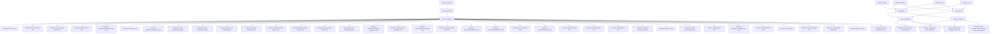

```mermaid
graph TD
  feature_unknown["Feature: unknown"]
  scenario_api_chat_test["Scenario: Api Chat Test"]
  env_unspecified["Env: unspecified"]
  suite_unmapped["Suite: unmapped"]
  scenario_api_doc_routes_test["Scenario: Api Doc Routes Test"]
  scenario_api_documents_extract_test["Scenario: Api Documents Extract Test"]
  scenario_api_export_pdf_test["Scenario: Api Export Pdf Test"]
  feature_platform["Feature: platform"]
  scenario_application_smoke_validation["Scenario: Application smoke validation"]
  env_guided["Env: guided"]
  suite_e2e_guided["Suite: e2e-guided"]
  suite_e2e_wizard["Suite: e2e-wizard"]
  env_wizard["Env: wizard"]
  scenario_assistantfeedbackrichtext_test["Scenario: AssistantFeedbackRichText Test"]
  scenario_audiomath_test["Scenario: AudioMath Test"]
  scenario_buildextractionpayload_test["Scenario: BuildExtractionPayload Test"]
  scenario_charter_download_api_spec["Scenario: Charter Download Api Spec"]
  scenario_charter_formschema_test["Scenario: Charter FormSchema Test"]
  scenario_charter_link_download_test["Scenario: Charter Link Download Test"]
  scenario_charter_normalize_test["Scenario: Charter Normalize Test"]
  scenario_charter_render_aliases_test["Scenario: Charter Render Aliases Test"]
  scenario_charter_render_handler_test["Scenario: Charter Render Handler Test"]
  scenario_charter_render_smoke_test["Scenario: Charter Render Smoke Test"]
  scenario_chat_no_placeholders_spec["Scenario: Chat No Placeholders Spec"]
  scenario_chatcharterwizard_integration_test["Scenario: ChatCharterWizard Integration Test"]
  scenario_chatcomposer_integration_test["Scenario: ChatComposer Integration Test"]
  scenario_chatdoctypecommands_test["Scenario: ChatDocTypeCommands Test"]
  scenario_composer_voice_status_test["Scenario: Composer Voice Status Test"]
  scenario_conversationmachine_test["Scenario: ConversationMachine Test"]
  scenario_conversationvalidation_test["Scenario: ConversationValidation Test"]
  scenario_doc_router_on_spec["Scenario: Doc Router On Spec"]
  scenario_doctemplatestore_test["Scenario: DocTemplateStore Test"]
  scenario_doctypecontext_test["Scenario: DocTypeContext Test"]
  scenario_doctyperouter_test["Scenario: DocTypeRouter Test"]
  scenario_doctypestate_test["Scenario: DocTypeState Test"]
  scenario_document_preview_sync_spec["Scenario: Document Preview Sync Spec"]
  scenario_export_pdf_test["Scenario: Export Pdf Test"]
  scenario_golden_conversations_test["Scenario: Golden Conversations Test"]
  feature_charter["Feature: charter"]
  scenario_guided_charter_chat_happy_path["Scenario: Guided charter chat happy path"]
  scenario_guidedstate_spec["Scenario: GuidedState Spec"]
  scenario_mergeintodraftwithlocks_test["Scenario: MergeIntoDraftWithLocks Test"]
  feature_chat["Feature: chat"]
  scenario_multimodal_assistant_chat_flows["Scenario: Multimodal assistant chat flows"]
  scenario_onfileattached_test["Scenario: OnFileAttached Test"]
  scenario_persist_spec["Scenario: Persist Spec"]
  scenario_preview_manifest_test["Scenario: Preview Manifest Test"]
  scenario_storage_safe_mode_test["Scenario: Storage Safe Mode Test"]
  scenario_syncstore_test["Scenario: SyncStore Test"]
  scenario_telemetry_fieldmetrics_test["Scenario: Telemetry FieldMetrics Test"]
  feature_voice["Feature: voice"]
  scenario_voice_microphone_level_indicator_renders_and_updates["Scenario: Voice microphone level indicator renders and updates"]
  feature_unknown --> env_unspecified
  env_unspecified --> suite_unmapped
  suite_unmapped --> scenario_api_chat_test
  suite_unmapped --> scenario_api_doc_routes_test
  suite_unmapped --> scenario_api_documents_extract_test
  suite_unmapped --> scenario_api_export_pdf_test
  feature_platform --> env_guided
  env_guided --> suite_e2e_guided
  suite_e2e_guided --> scenario_application_smoke_validation
  env_guided --> suite_e2e_wizard
  suite_e2e_wizard --> scenario_application_smoke_validation
  feature_platform --> env_wizard
  env_wizard --> suite_e2e_guided
  env_wizard --> suite_e2e_wizard
  suite_unmapped --> scenario_assistantfeedbackrichtext_test
  suite_unmapped --> scenario_audiomath_test
  suite_unmapped --> scenario_buildextractionpayload_test
  suite_unmapped --> scenario_charter_download_api_spec
  suite_unmapped --> scenario_charter_formschema_test
  suite_unmapped --> scenario_charter_link_download_test
  suite_unmapped --> scenario_charter_normalize_test
  suite_unmapped --> scenario_charter_render_aliases_test
  suite_unmapped --> scenario_charter_render_handler_test
  suite_unmapped --> scenario_charter_render_smoke_test
  suite_unmapped --> scenario_chat_no_placeholders_spec
  suite_unmapped --> scenario_chatcharterwizard_integration_test
  suite_unmapped --> scenario_chatcomposer_integration_test
  suite_unmapped --> scenario_chatdoctypecommands_test
  suite_unmapped --> scenario_composer_voice_status_test
  suite_unmapped --> scenario_conversationmachine_test
  suite_unmapped --> scenario_conversationvalidation_test
  suite_unmapped --> scenario_doc_router_on_spec
  suite_unmapped --> scenario_doctemplatestore_test
  suite_unmapped --> scenario_doctypecontext_test
  suite_unmapped --> scenario_doctyperouter_test
  suite_unmapped --> scenario_doctypestate_test
  suite_unmapped --> scenario_document_preview_sync_spec
  suite_unmapped --> scenario_export_pdf_test
  suite_unmapped --> scenario_golden_conversations_test
  feature_charter --> env_guided
  suite_e2e_guided --> scenario_guided_charter_chat_happy_path
  suite_unmapped --> scenario_guidedstate_spec
  suite_unmapped --> scenario_mergeintodraftwithlocks_test
  feature_chat --> env_guided
  suite_e2e_guided --> scenario_multimodal_assistant_chat_flows
  suite_e2e_wizard --> scenario_multimodal_assistant_chat_flows
  feature_chat --> env_wizard
  suite_unmapped --> scenario_onfileattached_test
  suite_unmapped --> scenario_persist_spec
  suite_unmapped --> scenario_preview_manifest_test
  suite_unmapped --> scenario_storage_safe_mode_test
  suite_unmapped --> scenario_syncstore_test
  suite_unmapped --> scenario_telemetry_fieldmetrics_test
  feature_voice --> env_guided
  suite_e2e_guided --> scenario_voice_microphone_level_indicator_renders_and_updates
  suite_e2e_wizard --> scenario_voice_microphone_level_indicator_renders_and_updates
  feature_voice --> env_wizard
```
